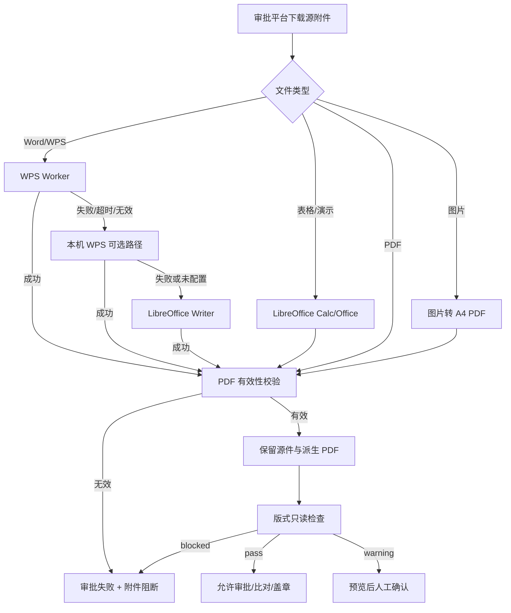
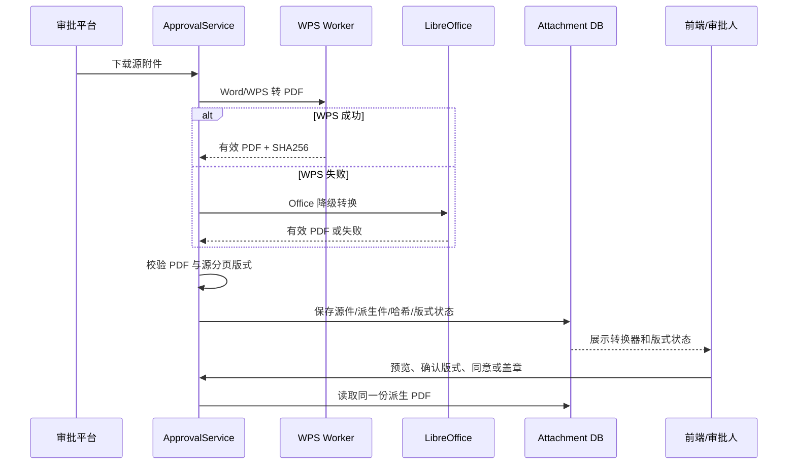

# WPS 文档转 PDF 实施方案

## 目标

为审批、比对、预览和盖章提供一条可追溯的 Office 文档转 PDF 链路：

1. Word/WPS 文档优先使用 WPS Worker 转换。
2. WPS 不可用、超时或输出无效时，自动降级到 LibreOffice。
3. 转换成功后必须生成可打开、至少包含一页的 PDF。
4. 转换失败时阻断审批流程，不能把 Office 原件伪装成主文件。
5. 保留原件和派生 PDF，并记录源件、派生件、转换器及 SHA256。
6. 版式检查只读分析，不改写源文档的分页和排版。

## 重要规则

### 不改写源文档版式

转换器输出的分页结果是审批文件的版式结果。系统不应为了让检查通过而移动段落、签署标记或签章区。

例如 Windows WPS 可能将“（以下无正文）”放在第 1 页末尾，将签署区放在第 2 页开头。只要签署区完整且与源文件分页一致，系统应保留这个结果。

版式检查负责发现问题并阻断风险，不负责修正文档布局。需要改变排版时，应回到 WPS/Word 修改源文件后重新上传。

### 转换顺序

| 输入格式 | 第一选择 | 失败后的选择 | 说明 |
| --- | --- | --- | --- |
| `.doc`、`.docx`、`.wps`、`.wpt` | WPS Worker | 本机 WPS（如配置）→ LibreOffice | 主审批文档路径 |
| `.xls`、`.xlsx`、`.xlsm`、`.xlt`、`.xltx`、`.et`、`.ett`、`.dps` | LibreOffice Calc/Office | 失败即阻断 | WPS Worker 当前只实现 Writer RPC |
| `.pdf` | 不转换 | 不适用 | 校验 PDF 是否有效 |
| 图片附件 | A4 图片转 PDF | 失败即阻断 | 仅适用于已允许的图片附件 |
| 其他格式 | 不支持 | 阻断 | 不能保留为审批主文件 |

## 系统架构



## 代码组成

### 转换实现

| 文件 | 作用 |
| --- | --- |
| `backend/ai_review/libreoffice_convert.py` | LibreOffice 转换、表格页宽处理、WPS 本机转换、PDF 有效性校验 |
| `backend/contracts/wps_worker_client.py` | 通过 Unix Socket 调用 WPS Worker，校验请求、输出路径、输出哈希和 PDF 头 |
| `backend/wps_worker/server.py` | 受控 WPS Worker 服务，校验任务目录、源件 SHA256、文件类型、超时和 PDF 页数 |
| `backend/wps_worker/native/wps_pdf_export.cpp` | WPS RPC 导出 PDF 的原生执行器 |
| `backend/contracts/approval_archive_utils.py` | 普通附件和 RAR 内附件的格式识别、转换和源件元数据保存 |
| `backend/contracts/approval_service.py` | 审批附件下载、转换编排、失败状态、派生文件保存和版式检查 |

### 版式和数据链路

| 文件 | 作用 |
| --- | --- |
| `backend/contracts/approval_pdf_layout.py` | 补充协议版式只读检查，按源文件分页判断签署区 |
| `backend/contracts/models.py` | `ApprovalAttachment` 源件/派生件血缘模型 |
| `backend/contracts/approval_compare_cache.py` | 比对统一读取派生 PDF |
| `backend/contracts/seal_bridge.py` | 盖章文件列表统一读取派生 PDF |
| `backend/contracts/api.py` | 审批列表、下载、原件下载、预览、同意和版式确认接口 |
| `backend/seal/api.py` | 盖章入口的审批文件绑定和版式闸门 |
| `frontend/src/features/contract-manager/ApprovalManager.tsx` | 转换器、版式状态、原件下载和人工确认提示 |

## WPS Worker 协议

### 请求

后端为每个任务创建独立目录：

```text
{WPS_WORKER_JOB_ROOT}/{request_id}/
├── source.docx
└── output.pdf
```

Socket 请求示例：

```json
{
  "request_id": "32 位小写十六进制字符串",
  "input_path": "/var/lib/htsc-wps/jobs/.../source.docx",
  "output_path": "/var/lib/htsc-wps/jobs/.../output.pdf",
  "source_name": "补充协议样本.docx",
  "source_sha256": "源文件 SHA256",
  "timeout_seconds": 180
}
```

响应必须包含：

```json
{
  "ok": true,
  "output_path": "请求中的 output_path",
  "output_sha256": "输出 PDF SHA256",
  "output_size": 123456,
  "page_count": 2,
  "provider": "wps-rpc",
  "provider_version": "WPS Office 版本",
  "elapsed_ms": 1200
}
```

Worker 会拒绝以下情况：

- 请求 ID、输入路径或输出路径越权；
- 源件扩展名不在 `.doc/.docx/.wps/.wpt`；
- 源件不存在、为空或超出大小限制；
- 源件 SHA256 不匹配；
- 输出文件不是 PDF、无法打开或没有页面；
- 导出程序不存在、返回非零、超时或生成了非预期输出。

后端收到失败响应后继续执行 Office 降级，不把失败响应当作成功转换。

## WPS Worker 的实现和开发逻辑

WPS Worker 不是一个普通的文件转换命令，而是由三层组成的隔离服务：

```text
Django 审批服务
  └─ wps_worker_client.py
       └─ Unix Socket JSON Lines
            └─ wps_worker/server.py
                 └─ xvfb-run
                      └─ htsc-wps-pdf-export
                           └─ WPS RPC SDK
                                └─ WPS Office Application
```

### 为什么不能直接调用 WPS 命令行

服务器上的 `/usr/bin/wps` 是桌面启动包装脚本，不能可靠处理 LibreOffice 风格的 `--headless --convert-to pdf` 参数。即使进程退出码为 0，也可能没有生成 PDF。

因此 Worker 使用 WPS RPC 的 `Documents.Open` 和 `Document.SaveAs2(..., wdFormatPDF)`，由 WPS 自己完成排版和分页。

### 原生导出器的开发逻辑

源文件：

```text
backend/wps_worker/native/wps_pdf_export.cpp
```

原生程序执行以下步骤：

1. 检查输入文件是普通文件，输出扩展名是 `.pdf`。
2. 创建 `QCoreApplication`，初始化 Qt 运行时。
3. 调用 `createWpsRpcInstance()` 创建 RPC 客户端。
4. 调用 `getWpsApplication()` 获取 WPS Application 对象。
5. 设置 `Visible=False`，避免弹出桌面窗口。
6. 获取 `Documents` 集合。
7. 使用 UTF-8→UTF-16 转换后的路径调用 `Documents.Open()`。
8. 以只读方式打开文档，不保存对源文档的修改。
9. 调用 `Document.SaveAs2()`，格式参数使用 `wdFormatPDF`。
10. 关闭 Document，再退出 WPS Application。
11. 检查输出文件存在后返回退出码和 JSON 结果。

RPC 导出器只负责“打开并导出”，不负责任务目录、权限、重试、哈希和业务状态；这些由 Python Worker 完成。

### 原生导出器的编译输入

源文件：

```text
backend/wps_worker/native/CMakeLists.txt
```

编译需要：

| 依赖 | 用途 |
| --- | --- |
| WPS RPC SDK | `wps/wpsapi.h`、common headers 和 RPC 库 |
| Qt5 Core | `QCoreApplication` |
| WPS Office library directory | 链接 WPS RPC 动态库 |
| C++17 编译器 | 编译原生导出器 |

构建命令：

```bash
cmake -S backend/wps_worker/native \
  -B build/wps-pdf-export \
  -DWPS_RPC_SDK_DIR=/opt/wps-rpc-sdk
cmake --build build/wps-pdf-export --config Release
install -m 0750 build/wps-pdf-export/htsc-wps-pdf-export \
  /opt/htsc-wps/bin/htsc-wps-pdf-export
```

`WPS_RPC_SDK_DIR` 必须包含：

```text
/opt/wps-rpc-sdk/include/wps/wpsapi.h
/opt/wps-rpc-sdk/include/common/
/opt/wps-rpc-sdk/lib/<architecture>/
```

不要把 WPS SDK、WPS 安装包、授权文件或字体复制进 Git；它们只能作为受控部署制品提供。

### Python Worker 的开发逻辑

源文件：

```text
backend/wps_worker/server.py
```

Python Worker 使用 `socketserver.UnixStreamServer` 监听 Unix Socket，每个连接读取一行 JSON，并返回一行 JSON。

请求处理顺序：

```text
读取一行 JSON
  → 检查 JSON 大小和对象类型
  → 检查 request_id 格式
  → resolve input/output 路径
  → 确认路径仍在 JOB_ROOT/request_id 内
  → 校验扩展名、普通文件、大小和 source_sha256
  → 限制 timeout_seconds
  → 获取全局转换锁
  → 启动 xvfb-run + 原生导出器
  → 超时则杀死整个进程组
  → 校验 PDF 文件头、页数和可打开性
  → 计算 output_sha256
  → 返回成功 JSON
  → 任何失败都删除 output.pdf 并返回固定错误码
```

单个 Worker 进程使用 `CONVERSION_LOCK` 串行处理 WPS 任务。原因是 WPS GUI/RPC 进程在并发打开多个文档时可能共享 profile、字体缓存或窗口状态。先用串行模型保证版式稳定，再根据压测结果设计多 Worker 实例扩展。

### Xvfb 和 WPS 运行环境

Worker 用 `xvfb-run -a` 为每次导出提供虚拟显示：

```text
xvfb-run -a \
  --server-args=-screen 0 1920x1080x24 -nolisten tcp \
  /opt/htsc-wps/bin/htsc-wps-pdf-export \
  <source_path> <output_path>
```

环境变量必须显式设置：

```text
HOME=/var/lib/htsc-wps/home
XDG_CONFIG_HOME=/var/lib/htsc-wps/home/.config
XDG_CACHE_HOME=/var/lib/htsc-wps/home/.cache
LD_LIBRARY_PATH=/opt/kingsoft/wps-office/office6
HTTP_PROXY=
HTTPS_PROXY=
ALL_PROXY=
NO_PROXY=*
```

这样可以避免 WPS 首次启动弹窗、用户 profile 冲突、代理外联和字体缓存漂移。

### Django 客户端如何调用 Worker

源文件：

```text
backend/contracts/wps_worker_client.py
```

调用顺序：

1. 生成 `secrets.token_hex(16)` 作为 32 位 `request_id`。
2. 在 `WPS_WORKER_JOB_ROOT/request_id` 创建任务目录。
3. 按源文件扩展名写入 `source.<ext>`，权限设置为 `0640`。
4. 计算源件 SHA256。
5. 发送 JSON 请求到 `WPS_WORKER_SOCKET`。
6. 等待单行 JSON 响应，客户端超时为任务超时加保护时间。
7. 要求 `ok=true`。
8. 要求 Worker 返回的 `output_path` 与本次任务路径完全一致。
9. 读取 output.pdf，检查 `%PDF-` 文件头。
10. 重新计算输出 SHA256，并与响应值比较。
11. 返回 `content/provider/provider_version/elapsed_ms`。
12. 在 `finally` 删除任务目录。

客户端只负责 Worker 传输和完整性校验。它不负责决定审批是否通过，审批状态由上层转换服务和版式闸门处理。

### Worker 错误到 Office fallback 的映射

| Worker 错误码 | 含义 | 上层动作 |
| --- | --- | --- |
| `invalid_request` | 请求结构或路径不合法 | 记录程序错误，不重试同一请求 |
| `invalid_source` | 扩展名、大小或文件不存在 | 阻断该附件 |
| `source_hash_mismatch` | 源文件在任务目录中被改变 | 删除任务并重新下载 |
| `worker_unhealthy` | 导出器或 RPC 不可用 | 尝试 Office fallback |
| `rpc_start_failed` | WPS RPC 初始化失败 | 尝试 Office fallback |
| `open_failed` | WPS 无法打开源文件 | 尝试 Office fallback |
| `export_failed` | SaveAs2 失败 | 尝试 Office fallback |
| `timeout` | 超过任务时间 | 杀死进程组后尝试 Office fallback |
| `invalid_pdf` | 输出不是有效 PDF | 不接受输出，尝试 Office fallback |

对于 Word/WPS，Office fallback 成功后设置 `provider=libreoffice` 和 `requires_layout_confirmation=True`。如果 fallback 也失败，审批进入 `failed`，不能保存为主文件。

### systemd 启动和权限

源文件：

```text
deploy/systemd/htsc-wps-worker.service
```

服务用户 `htsc-wps` 只拥有以下写权限：

```text
/var/lib/htsc-wps
/run/htsc-wps
```

服务启用的关键隔离项：

- `PrivateNetwork=true`：Worker 不需要外网；
- `IPAddressDeny=any`：阻止网络地址访问；
- `NoNewPrivileges=true`；
- `PrivateTmp=true`；
- `PrivateDevices=true`；
- `ProtectSystem=strict`；
- `ProtectHome=true`；
- `ReadWritePaths` 只放行任务目录和 Socket 目录；
- `UMask=0007`；
- Unix Socket 权限 `0660`。

部署顺序：

```bash
sudo install -d -o htsc-wps -g htsc-wps -m 2770 /var/lib/htsc-wps/jobs
sudo install -d -o htsc-wps -g htsc-wps -m 0700 /var/lib/htsc-wps/home
sudo install -d -o htsc-wps -g htsc-wps -m 0770 /run/htsc-wps
sudo systemctl daemon-reload
sudo systemctl enable --now htsc-wps-worker
sudo systemctl status htsc-wps-worker --no-pager
```

### Worker 开发验收

在启用业务流量前，必须单独验证：

```text
1. 最小 docx 可以成功转 PDF
2. .doc/.wps/.wpt 扩展名走同一 RPC 路径
3. 非法扩展名被拒绝
4. 任务目录越权被拒绝
5. 源件 SHA256 改变时被拒绝
6. 输出路径不是任务目录时被拒绝
7. WPS 无法打开时返回 open_failed
8. RPC 超时时进程组被清理
9. PDF 无效时 output.pdf 被删除
10. Worker 重启后 Socket 会重新创建
11. 任务结束后没有残留 source/output 文件
12. 50 个串行任务没有残留 WPS/Xvfb 进程
```

## Office 降级策略

`convert_approval_bytes_to_pdf()` 的核心行为：

1. 对 Word/WPS 文档调用启用的 WPS Worker。
2. Worker 失败后尝试配置的本机 WPS 二进制。
3. WPS 路径均失败后调用 `convert_bytes_to_pdf()`。
4. LibreOffice 输出必须通过 PDF 头检查和 PyMuPDF 打开检查。
5. 两条引擎都失败时抛出包含 WPS 和 Office 原因的异常。

LibreOffice Word 路径会先处理 `.doc` 和 `.docx` 的修订内容，再导出 PDF。表格路径会使用 Calc UNO 调整页宽；UNO 失败时才进入表格文本兜底，兜底仍失败则阻断。

## 源件和派生件血缘

每个审批附件对应一条 `ApprovalAttachment`：

| 字段 | 含义 |
| --- | --- |
| `file_index` | 审批附件序号，主文件为 `0` |
| `source_path` / `source_file_name` | 原始 Office/WPS/图片路径和文件名 |
| `source_sha256` | 原始文件哈希 |
| `derived_path` / `derived_file_name` | 实际参与审批、比对、预览、盖章的 PDF |
| `derived_sha256` | 派生 PDF 哈希 |
| `conversion_provider` | `wps-rpc`、`wps`、`libreoffice` 或空值 |
| `conversion_version` | 转换器版本 |
| `conversion_fallback_reason` | WPS 失败或使用 Office 的原因 |
| `requires_layout_confirmation` | 是否需要人工核对版式 |
| `layout_status` | `not_applicable`、`pass`、`warning`、`blocked` |
| `layout_issues` | 版式问题及严重等级 |
| `layout_metrics` | 页数、页尺寸、检查版本等指标 |

源件下载接口：

```text
GET /api/v1/contracts/approvals/{approval_id}/source?file_index=0
```

派生 PDF 下载和预览接口：

```text
GET /api/v1/contracts/approvals/{approval_id}/download?file_index=0
GET /api/v1/contracts/approvals/{approval_id}/download?file_index=0&preview=1
```

有血缘记录时，下载接口直接读取 `derived_path`，不在每次预览时重新调用 LibreOffice。

## 版式检查规则

当前补充协议检查包括：

- 标题、甲乙方、引言、补充条款标题和第 1 条的间距；
- 正文基准行距；
- “（以下无正文）”是否存在；
- 最终页是否包含完整签署区：甲方、乙方、盖章、电话、签订日期。

### 源分页处理

Windows WPS 常见合法结果：

```text
第 1 页末尾： （以下无正文）
第 2 页开头： 甲方/乙方签署区
```

检查器将这种结果记为 `source_preserved`，不会移动文本，也不会重排 PDF。只有最终页签署区缺少必要字段，或 PDF 无法打开时，才记为 `blocked`。

### 状态闸门

| 状态 | 行为 |
| --- | --- |
| `pass` | 可继续审批、比对和盖章 |
| `warning` | 前端要求预览并人工确认；确认后才可同意/盖章 |
| `blocked` | 阻断同意、自动比对、盖章和签章绑定 |
| 转换失败 | 审批状态 `failed`，附件 `blocked`，不保留为主文件 |

## 审批流程



## 失败处理

### WPS 失败、Office 成功

- `conversion_provider=libreoffice`；
- `conversion_fallback_reason` 保存 WPS 失败原因；
- 派生 PDF 保留；
- 默认要求人工预览确认版式；
- 原 Office 文件仍可下载。

### WPS 和 Office 都失败

- 审批状态设为 `failed`；
- 保存源件记录，`derived_path` 为空；
- 附件版式状态设为 `blocked`；
- 不提交自动比对和 AI 预审；
- 同意、盖章、签章绑定接口全部拒绝；
- 前端显示失败原因和重新同步入口。

### PDF 无法打开

即使文件头是 `%PDF-`，PyMuPDF 打不开或页数为零也视为失败。不能仅凭扩展名或文件头放行。

## 配置

生产环境建议：

```dotenv
APPROVAL_OFFICE_PDF_CONVERTER=wps_worker
APPROVAL_WPS_BINARY=
APPROVAL_LAYOUT_CHECK_ENABLED=True
APPROVAL_LAYOUT_GUARD_ENABLED=True
WPS_WORKER_ENABLED=True
WPS_WORKER_SOCKET=/run/htsc-wps/wps-worker.sock
WPS_WORKER_JOB_ROOT=/var/lib/htsc-wps/jobs
WPS_WORKER_TIMEOUT_SECONDS=180
```

应用服务和 Worker 服务必须共享任务根目录，并使用最小权限访问 Unix Socket。Worker 不应暴露 TCP 端口。

## 部署

### Worker 服务

服务文件：

```text
deploy/systemd/htsc-wps-worker.service
```

关键依赖：

- WPS Office 及 RPC SDK；
- `xvfb-run`；
- `/opt/htsc-wps/bin/htsc-wps-pdf-export`；
- `/var/lib/htsc-wps/jobs`；
- `/run/htsc-wps/wps-worker.sock`。

部署后检查：

```bash
sudo systemctl daemon-reload
sudo systemctl enable --now htsc-wps-worker
sudo systemctl status htsc-wps-worker --no-pager
sudo journalctl -u htsc-wps-worker -n 100 --no-pager
```

### 数据库

```bash
backend/.venv/bin/python backend/manage.py migrate
```

新增模型迁移：

```text
backend/contracts/migrations/0060_approvalattachment.py
```

## 历史数据处理

历史记录可能存在以下状态：

- `approval.file` 仍是 `.docx`；
- OCR 曾经临时转换过 PDF，但没有保存派生 PDF；
- 没有 `ApprovalAttachment` 记录；
- 旧版式检查结果使用旧检查版本。

处理原则：

1. 不覆盖源件。
2. 通过重新同步或受控迁移任务重新执行当前 WPS→Office 链路。
3. 生成派生 PDF 后写入 `derived_path` 和 SHA256。
4. 清理依赖旧文件的 OCR/比对缓存后重新生成。
5. 重新运行版式检查，保留源文件分页。

只对 PDF 运行版式回填时可使用：

```bash
backend/.venv/bin/python backend/manage.py backfill_approval_pdf_layout \
  --approval-id 401490 --force
```

历史 Office 文件不能仅靠扩展名回填；必须经过实际转换并校验 PDF。

## 测试方案

### 单元测试

```bash
backend/.venv/bin/python backend/manage.py test \
  contracts.test_approval_pdf_layout \
  contracts.tests.ApprovalArchiveAttachmentTests \
  contracts.tests.LibreOfficeConvertTests \
  --keepdb
```

必须覆盖：

- WPS Worker 成功；
- WPS Worker 失败后 Office 成功；
- WPS 和 Office 都失败；
- `.xls/.xlsx/.et/.dps` 表格转换；
- PDF 无效或零页；
- 源件/派生件 SHA256；
- 多附件 `file_index`；
- Office 回退产生 warning；
- 源分页“第 1 页末尾标记、第 2 页签署区”；
- 签署区缺字段时 blocked；
- blocked 时同意、比对、盖章和 AI 预审均停止。

### 真实样本验收

以 `补充协议样本.docx` 为验收样本：

1. 用 Windows WPS 打开源件，记录页数和关键文字分页。
2. 通过系统同步审批文件。
3. 确认 `conversion_provider=wps-rpc` 或明确的 Office fallback。
4. 用 PyMuPDF 检查派生 PDF 页数和文本分页。
5. 确认“（以下无正文）”仍在 Windows WPS 对应页面。
6. 确认派生 PDF 版式状态为 `pass` 或按策略进入 `warning`。
7. 确认预览、比对和盖章读取同一 `derived_path`。

示例检查：

```bash
file backend/media/approvals/.../source.docx
backend/.venv/bin/python backend/manage.py shell -c \
  "from contracts.models import ApprovalAttachment; print(list(ApprovalAttachment.objects.values('file_index','source_sha256','derived_sha256','layout_status')))"
```

## 运维排障

### WPS Worker 不可用

检查：

```bash
test -S /run/htsc-wps/wps-worker.sock
sudo systemctl status htsc-wps-worker --no-pager
sudo journalctl -u htsc-wps-worker -n 100 --no-pager
```

预期行为是自动回退 LibreOffice。若 LibreOffice 也失败，审批必须进入 `failed`，不能显示为已下载成功。

### PDF 排版与 Windows WPS 不一致

按以下顺序排查：

1. 下载系统保存的源件，确认 SHA256 与审批附件一致。
2. 下载 `derived_path` 对应 PDF，不要使用 OCR 临时文件。
3. 查看 `conversion_provider` 和 `conversion_fallback_reason`。
4. 对比页数、页尺寸、分页文字和签署区位置。
5. 如果源件本身在 Windows WPS 中的分页是正确的，禁止通过代码移动文字；应检查转换器版本、字体和 WPS Worker 环境。
6. 更换转换器后重新生成派生 PDF，并重新执行版式检查。

### 字体差异

WPS Worker 使用独立的 `HOME`、字体和缓存目录。检查：

- Worker 是否加载了合同使用的中文字体；
- WPS 与 Windows WPS 版本是否存在明显差异；
- 是否误用 LibreOffice 作为主转换器；
- 是否在预览阶段重复转换了已经存在的派生 PDF。

## 验收标准

- [ ] Word/WPS 首选 WPS Worker。
- [ ] WPS 失败自动降级 Office。
- [ ] 两者失败会阻断，不保留 Office 原件为主文件。
- [ ] 表格格式进入明确的 Calc/Office 路径。
- [ ] 源件、派生 PDF、转换器和哈希可追溯。
- [ ] 预览、比对和盖章读取同一派生 PDF。
- [ ] 版式检查只读，不移动源文档内容。
- [ ] Windows WPS 合法分页在系统中保持不变。
- [ ] 多附件的 `file_index`、路径和哈希不串号。
- [ ] Worker、数据库迁移和回归测试均通过。
